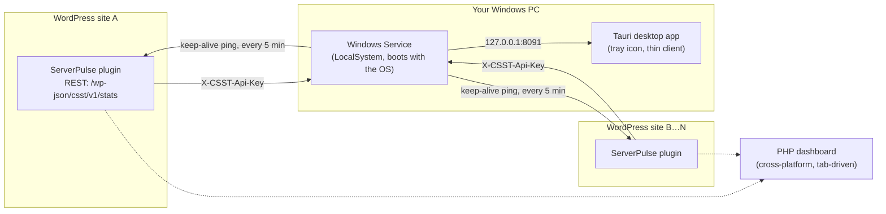

# Controll Server Monitor

**Real browser-to-server speed testing, fleet-wide health monitoring, and 24/7 keep-alive — for WordPress sites on shared hosting, where you don't control the box.**

[](https://github.com/vincentrathbone-web/controll-server-connection-speed-test/actions/workflows/build-windows.yml)
&nbsp;&nbsp;[**⬇ Latest desktop app release**](https://github.com/vincentrathbone-web/controll-server-connection-speed-test/releases/latest)

This repo is three programs that work as one system:

| Component | What it is | Status |
|---|---|---|
| **[Controll Server Connection Speed Test](controll-server-connection-speed-test/)** | A WordPress plugin ("ServerPulse") — the data source. Installed on every monitored site. | 🟢 Live in production |
| **[Controll Server Monitor (native)](controll-server-monitor-rs/)** | A Windows Service + Tauri desktop app — the fleet dashboard. Monitors 24/7, independent of login. | 🟢 Current |
| **[Controll Server Monitor (PHP)](controll-server-monitor/)** | The original PHP dashboard. Cross-platform, browser-tab-driven. | 🟡 Superseded, still supported |

They talk over one contract: `GET /wp-json/csst/v1/stats`, authenticated with a per-site key in the `X-CSST-Api-Key` header. The plugin serves it; both dashboards consume it.



---

## Why this exists

Shared hosting gives you no control plane: no host-level monitoring, disk quota numbers that lie (they report the *server's* disk, not your *account's* allocation), CPU/RAM figures that mix your site in with every other tenant on the box, and hosts that quietly suspend an idle site and take several seconds to wake it back up. This project exists to fix all four, from outside the hosting stack entirely.

## What makes it different

- **Account-scoped resource numbers on shared hosting, not server-wide ones.** Disk quota, CPU, and RAM are read from cPanel's own `uapi` (the same mechanism cPanel's web UI uses internally) via `shell_exec` — zero configuration, no API token needed, works even when a host hides "Manage API Tokens" behind a plan restriction. Falls back to the manual cPanel API-token route, then to raw filesystem/`sys_getloadavg()` numbers as a last resort — and always tells you which source produced a given figure.
- **Monitoring that survives you logging out, closing the app, or the app crashing.** The Windows Service and the desktop app are two separate processes on purpose. The service does 100% of the real work — polling, keep-alive pinging, SQLite writes — and runs as `LocalSystem` from boot. The GUI is a disposable thin client. Closing it hides it to the tray; killing it outright still doesn't stop monitoring.
- **A keep-alive strategy that survives Wordfence, unlike third-party uptime monitors.** Services like UptimeRobot ping from a large, rotating IP pool — impractical to whitelist against a Wordfence setup that blocks international traffic. This pings from one known machine, so only one IP ever needs allowlisting. Every WordPress site also gets a self-contained, site-specific PowerShell script generated on demand (URL and task name baked in) as a fallback that needs no companion app at all.
- **A REST endpoint that survives "lock down the whole API" hardening plugins.** Some hardening plugins (e.g. the Members plugin's Private REST API option) reject *every* unauthenticated REST call — including this plugin's own API-key-gated one — before its permission check ever runs. A late-priority filter recognizes a valid key and clears the rejection for `/csst/v1/` only, leaving every other route's lockdown untouched.
- **One schema, three consumers.** The Rust service, the PHP dashboard, and (historically) the plugin's own site registry all read/write the identical SQLite schema. `monitor.sqlite` can be copied between the PHP dashboard and the native app with zero migration.
- **A real fleet view, not just "is it up."** Every site card shows disk/CPU/memory against its *actual* allocation, its Duplicator Pro backup freshness, and whether its plugin version is behind the newest one currently seen across the fleet — so an outdated install is visible without opening it.

---

## Features

### 🔌 WordPress plugin — "ServerPulse" (`controll-server-connection-speed-test`, v1.7.7)

**Connection speed test** (real browser ↔ server, not a synthetic benchmark)
- Latency, jitter, packet loss over 8 ping samples
- P50 / P95 latency percentiles, so a few bad samples aren't hidden by an average
- Download (3 parallel streams) and upload throughput, 8s each
- A single combined quality grade
- Persistent history (200 records), CSV export, rolling 1h/24h/7d trend comparison

**Server Diagnostics Snapshot**
- Database round-trip, PHP compute benchmark, memory limit vs. usage, load average, CPU count, total RAM
- **Hosting Disk Quota (cPanel)** — real account quota via `uapi`, auto-detected, hourly-cached, no setup
- **Live Resource Usage** — 2-second CPU/memory sparklines, account-scoped on CloudLinux/LVE, client-driven (pauses when the tab isn't visible)
- **Duplicator Pro Backup** card — last backup status/age, read straight from Duplicator's own table
- **Plugin Load Correlation** — active plugin count, query count/time, peak memory, and benchmark timings recorded on every diagnostics run, so "did adding a plugin slow things down" has an actual answer
- **Process Monitor** tab — top processes by CPU, where hosting permits it

**Automation**
- Hourly disk-usage monitor; emails the site admin every hour while usage stays ≥ 90%, stops automatically once it drops
- **Remote Monitoring API** — `GET /wp-json/csst/v1/stats`, API-key gated, read-only, no side effects on history
- **Keep-Alive Script generator** — one click downloads a `.ps1` pre-baked with that site's URL, installs a Scheduled Task pinging it every 5 minutes

### 🖥️ Desktop app + Windows Service (`controll-server-monitor-rs`, v0.1.5) — current

- **Windows Service** (`ControllServerMonitor`) — owns the site registry, stats polling, and keep-alive pinging; starts at boot; runs whether or not anyone is logged in
- **Tauri desktop app** — native window + tray icon; a thin client that only *looks at* the service
- Card view (whole fleet at a glance) and List view (one site, live trend charts)
- Continuous keep-alive ping of every site every 5 minutes, **30-day persisted history per site** (not just "the last result"), real HTTP status/error shown per ping, desktop notification on an OK→FAIL transition
- Export/Import site registrations as JSON (native Save-As dialog inside the app) — rebuild a new PC without re-typing every API key
- Tray menu shows live service state and lets you Start/Stop it (elevation-prompted only when it needs to be)

### 🗂️ PHP dashboard (`controll-server-monitor`) — superseded, still supported

Same UI, no install beyond a PHP web server. Polls only while the browser tab is open and focused — the exact limitation the Rust rewrite was built to remove. Kept for non-Windows use and as a reference implementation; the identical SQLite schema means either can pick up where the other left off.

---

## Challenges — and how they were solved

This system was built entirely against a real shared-hosting/Windows environment, so most of the hard problems were discovered by breaking, not by anticipating. Kept here so nothing breaks the same way twice.

| Challenge | What actually happened | Fix |
|---|---|---|
| **Shared-hosting resource numbers are lies** | `disk_free_space()` and `sys_getloadavg()` report the *whole physical server* — every other tenant's usage included — not this account's actual package limits. | Call cPanel's local `uapi` binary directly via `shell_exec` (`Quota::get_quota_info`, `ResourceUsage::get_usages`'s `lvecpu`/`lvememphy`) — the same account-scoped numbers cPanel's own UI shows, with zero stored credentials. HTTP-API and filesystem fallbacks kept for hosts without shell access. |
| **CloudLinux CPU units are confusing** | Early version showed raw quota units like "2% / 100%", which reads as almost-idle when it might mean "using its entire allotted core." | CloudLinux's CPU limit is a percent-of-one-physical-core (100 = 1 core). Converted to real core-equivalents (`cpuUsedCores`/`cpuMaxCores`) and unified the field semantics with the system-load-average fallback, so consumers format both identically. |
| **A hardening plugin silently blocked the monitoring API** | A "require login for every REST request" plugin (Members) rejects *all* unauthenticated REST calls — including this plugin's own API-key-checked endpoint — via a filter that runs *before* the key is ever checked. Symptom: "not connected," and regenerating the key never helped, because the key was never reached. | A late-priority (`999`) filter on `rest_authentication_errors` recognizes a valid key and clears *only* the earlier rejection for `/csst/v1/` requests, leaving every other route's lockdown untouched. |
| **A silently unregistered Windows Service looks exactly like a broken app** | Two separate installer bugs: Tauri preserves a bundled resource's relative path (`bin/foo.exe` lands at `$INSTDIR\bin\foo.exe`, not `$INSTDIR\foo.exe`) — the install hook pointed at the wrong path; and Tauri's NSIS default is a **per-user** install with no UAC prompt, so elevation-requiring service registration failed regardless. | Fixed the resource path; set `"installMode": "perMachine"`; made the install hook check `ExecWait`'s exit code and surface a dialog on failure instead of swallowing it. |
| **A camelCase rename bug broke keep-alive silently** | Every field in `KeepAliveStatus` had `#[serde(rename = "...")]` to camelCase — except `site_id`. It serialized as `site_id`, but the frontend looked up `map[s.siteId]`, always got `undefined`, and every site showed "Not pinged yet" regardless of real ping history. No error anywhere pointed at the cause. | Added the missing rename. Lesson kept in the codebase: when a JS lookup against an API response comes back empty, check the actual JSON key names match — don't assume a struct's derive output matches its neighbors just because they're declared the same way. |
| **A raw `fetch()` failure reads like the wrong bug** | An unreachable local service reports as a bare "Failed to fetch" in the browser — which looks exactly like *the monitored site* is broken, not the local background service. Cost real debugging time chasing the wrong layer. | Every API call funnels through one `apiFetch()` wrapper that names the actual cause ("Cannot reach the Controll Server Monitor background service…") instead of letting the raw error surface. |
| **`[hidden]` loses to `display: grid`** | An element with both the `hidden` attribute and a class setting `display` stays visible — author styles beat the browser's default `[hidden]` rule. Bit twice, in two separate codebases. | Always pair such classes with an explicit `.that-class[hidden] { display: none; }`. |
| **Windows resolves `localhost` IPv6-first** | Some local Apache setups (e.g. Laragon) don't listen on `::1`, causing a multi-second connection timeout that looks like a hung server. | Use `127.0.0.1` explicitly for any local endpoint. |
| **GNU `windres` can't parse this project's own path** | The dev machine's path contains spaces and a bare `-` (`Controll - Documents`); `windres` (which embeds the app icon/version info during a GNU-toolchain Tauri build) splits that into invalid arguments, producing a baffling `unrecognized command-line option '-\'`. | Build into a space-free `CARGO_TARGET_DIR` (`C:\controll-build`) outside the repo. CI sidesteps this entirely by using the MSVC toolchain, which `windows-latest` GitHub runners ship with. |
| **A Scheduled Task installation failed with a cryptic XML error** | The keep-alive script's `[TimeSpan]::MaxValue` overflowed what Task Scheduler's XML schema accepts for `-RepetitionDuration`, failing with "value...incorrectly formatted or out of range." | Switched to a 10-year duration — effectively indefinite for this use case, safely within range. |
| **No webpage can show a native "Save As" dialog, ever** | The `<a download>` trick always saves straight to the browser's configured downloads folder with no prompt — a deliberate cross-browser restriction, not a bug. This applies even inside the app's own Tauri window by default. | Opted in explicitly via `tauri-plugin-dialog` + a capability grant (`dialog:allow-save`) + one narrow custom command for the actual file write. The same page still falls back to the plain download trick when opened in an ordinary browser tab, where no native picker can exist at all. |

---

## Getting started

1. **Install the plugin** on every WordPress site you want to monitor — see [`controll-server-connection-speed-test/README.md`](controll-server-connection-speed-test/README.md). Generate an API key from its **Remote Monitoring API** panel.
2. **Install the desktop app** — grab the latest installer from [Releases](https://github.com/vincentrathbone-web/controll-server-connection-speed-test/releases/latest), run it (accept the UAC prompt — it registers the Windows Service), then register each site in **Setup** using the endpoint URL + API key from step 1.
3. *(Optional, no companion app)* On any individual site, use **Keep Server Awake → Download Keep-Alive Script** from the plugin's admin page instead, if you don't want to run the desktop app on that machine.

Full details, requirements, and data locations are in each component's own README:
[Plugin](controll-server-connection-speed-test/README.md) · [Desktop app](controll-server-monitor-rs/README.md) · [PHP dashboard](controll-server-monitor/README.md)

## Building from source

CI builds the Windows installer on every `v*` tag push (or manually) — see [`.github/workflows/build-windows.yml`](.github/workflows/build-windows.yml) and the [Actions tab](https://github.com/vincentrathbone-web/controll-server-connection-speed-test/actions/workflows/build-windows.yml).

To build locally:

```powershell
cd controll-server-monitor-rs
.\build.ps1            # service + app
.\build.ps1 -Bundle    # also the NSIS installer
```

WordPress plugin and PHP dashboard releases use their own `package.ps1` — see [`packaging-skill.md`](packaging-skill.md).

## Security notes

- Every plugin AJAX endpoint and admin page checks `manage_options` and verifies a nonce; the REST endpoint is gated by a per-site key compared with `hash_equals`.
- API keys are stored in plaintext (`wp_options` on the plugin side, SQLite on the dashboard side) — treat both as sensitive. The PHP dashboard ships `.htaccess` denials on its data/includes folders and has no login of its own; it's built for local, single-operator use.
- The Rust service's HTTP API binds to `127.0.0.1` only — never reachable off-machine.
- No automated test suite exists in any of the three codebases. Everything has been verified by running it for real — manual testing is the standard here, not an oversight.

## License

[GPL-2.0-or-later](LICENSE) — matching the WordPress plugin's own license header, consistent across all three components.
